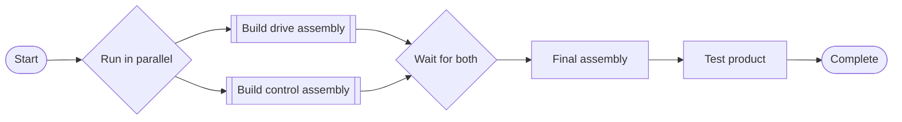

# Process Sequence: product and assembly editor

Status: architecture proposal with an initial editor implementation, 2026-09-30.
This document distinguishes findings in the supplied specifications and current code from proposed
application behavior. It supersedes the architectural assumptions identified below, not the historical
verification notes in `processSequenceModule.md`.

## Implemented editor

`ProcessSequence/index.vue` now defaults to an assembly workspace. The original editor is preserved
in `components/LegacySequenceEditor.vue` and remains available in the Existing BPMN editor tab.

The new editor provides a BoM tree, separate sequences per material occurrence, process-only nested
subprocesses, reusable calls, ordered steps, parallel branches with an explicit all-branches join,
and a combined step/dependency view. A Vue Flow canvas renders rounded process nodes, subprocess
calls, branch headers, and explicit split/join connections. Select nodes for the right-hand parameter
inspector; open calls or use the BoM tree to navigate. Toolbar actions insert after the selected node
or at the start of a selected branch. Edges and layout are derived from the structured plan, preserving
wait-for-all semantics without dangling connections. Pan, zoom, and fit controls aid navigation.

The Docker demo supports Vite hot reload through `examples/ProcessSequence/docker-compose.dev.yml`.
Compose Watch synchronizes source changes into the container's Linux filesystem; keep Watch running
while editing. This avoids the slow cold loads observed with a Windows source bind mount.
See the example README for startup commands and the direct link to the saved robot assembly plan.

New process readers preserve all three parameter groups and ProcessBoM; the inspector supports
per-step resource skills and constant or reference parameter bindings. References retain the source
AAS, submodel, and element path. New drafts need no resource selection.

Persistence uses a separate v2 `ProcessSequencePlan` submodel on the product, with a Definition File
and Product ReferenceElement. Its ID is deterministically derived from the product AAS ID, and the
product receives an explicit submodel reference. Existing BPMN storage remains intact. Save/load
validates schema version, ownership, hierarchy, and call cycles; drafts can retain missing assignments.
The browser retains session drafts. A pre-save comparison detects stale server contents, but it is
not an atomic server lock or ETag transaction.

The implementation does not yet supply an execution adapter, immutable published revisions,
equipment scheduling/contract validation, automatic BPMN conversion, or execution-history writing.
The decisions and implementation sequence below describe the broader target, including those items.
The BoM reader follows nested Entity statements; it does not infer hierarchy from arbitrary
relationship graphs. Parameters are linked from existing source entries; authoring standard source
submodels is left to their editors.

Tests live in `utils/plan.test.ts`, `composables/usePlanRepository.test.ts`, and
`tests/integration/process-plan.pw.ts`. The integration test requires `PS_REPO_URL` pointing to a
disposable BaSyx repository and a UI built from this checkout. `IT_BROWSER_CHANNEL=chrome` uses
installed Chrome where Playwright's bundled browser is unavailable. The test creates and removes
its own AAS/submodel fixtures and clears browser draft recovery before verifying server reload.

Verification on 2026-09-30: module/integration-test ESLint passed with zero warnings, project TypeScript
checking passed, and a current-branch Vite build passed. The module suite passed 124 tests; three legacy
live-reader tests were skipped because their separate demo fixtures were not configured. The new
Playwright integration test passed against a real local BaSyx repository and the freshly built UI. It
verified tree navigation, nested subprocess creation, all three parameter groups, a resource skill and
constant binding, parallel branches, server attachment contents, reload with browser recovery cleared,
and the combined-steps view. No execution-engine behavior was tested or implemented.

## Direction

Graph and development-container verification on 2026-10-01: 129 module tests passed (three separate
legacy live-reader tests skipped); nested graph layout and branch insertion tests passed after the
layout adjustment. Module/config/test ESLint and TypeScript checks passed. Playwright passed the
author/reorder/remove/save/reload flow against the running Docker development UI. A host-file edit
and revert both hot reloaded the same browser document in approximately one second; subprocess
navigation and the parameter inspector were verified afterward. The saved seven-step robot demo
remains available. No equipment execution was attempted.

Make the product structure the starting point. Selecting the whole product opens its overall process;
selecting a subassembly opens the process that produces that assembly. Each process can contain steps,
calls to subprocesses, and parallel branches. Resource selection happens on individual steps and can
remain unresolved while an engineer is planning.

Use an application-owned, versioned process model as the source of truth. A custom editor can render
that model using the Vue Flow dependency already used by the repository's Hierarchical Structures
viewer. Keep BPMN as a possible import/export or execution adapter, subject to the sequencer's actual
interface. Replacing the canvas alone will not resolve the current data-model problems.

BPMN itself supports subprocesses and parallel fork/join behavior; those features are not reasons it
must be removed. The reason for a custom authoring interface is to expose manufacturing concepts and
assembly navigation directly. See the [OMG BPMN 2.0.2 specification](https://www.omg.org/spec/BPMN/2.0.2/PDF),
sections 10.3.5 and 13.4.1. A custom model also creates a responsibility to define execution semantics,
validation, versioning, and conversion explicitly.

## What the supplied IDTA documents establish

The source documents are the user's local PDFs:

- `C:/Users/marti/Downloads/IDTA 02031-1_Submodel_ProcessParameters_Type (2).pdf`
- `C:/Users/marti/Downloads/IDTA 02031-2_Submodel_ProcessParameters_Instance.pdf`

| Information | Specification evidence | Consequence for this module |
| --- | --- | --- |
| Inputs for process execution | Part 1, section 1.2, page 6 | `ProcessParameters` does not prescribe execution order. Its collection order is not an execution contract. |
| Hierarchy and sequencing | Part 1, section 1.2, page 6 | The document directs use with Hierarchical Structures. The supplied PDFs do not establish a mapping from every BoM parent/child relation to a process dependency. |
| Process inputs | Part 1, section 2.4, pages 13–14 | Read `ProductParameters`, `ProcessParameters`, `ResourceParameters`, and `ProcessBoM`, alongside process metadata. |
| Process identity | Part 1, section 2.4, page 13 | `ProcessId` identifies a process. It is not defined here as the identifier of a material entity. |
| Material involvement | Part 1, section 2.4, pages 13–14 | `ProcessBoM` describes products or semifinished products involved in the process. Preserve this information; its detailed mapping requires real data. |
| Execution records | Part 2, section 2, page 11, and sections 2.2–2.4, pages 11–14 | `ExecutedProcesses` holds runs, copied inputs, outputs, process status/results, timing, stages, and errors. It is separate from the editable plan. |

The PDFs contain ambiguities in identifier tables. Validate semantic IDs against the corresponding
machine-readable template and actual payloads before defining accepted aliases. An observed identifier
difference does not by itself prove that a BaSyx server rewrote it. Prefer semantic identification with
explicit, tested compatibility fallbacks; do not assume every deployed process must have one exact
`idShort` spelling. Part 1 Annex A permits alternative unique names for repeated elements.

## Concrete problems in the current implementation

These are static code findings, not a new browser verification:

| Current code | Finding | Required change |
| --- | --- | --- |
| `ProcessSequence/index.vue` | The editor is gated on choosing one resource, and the left pane is a skill palette. | Open the assembly workspace before binding resources; put assembly navigation on the left. |
| `utils/readBillOfMaterial.ts`, `types/index.ts` | Material entities become a flat list of names, asset IDs, and depths. Parent references and material relationships are not retained. | Preserve occurrence identity, parent/child relationships, source references, and unresolved references. |
| `utils/readers.ts` | Only product parameters are read from each process. | Read all three parameter groups and preserve `ProcessBoM` and source element references. |
| `utils/draftGenerator.ts`, existing documentation | Process collection order becomes a straight sequence. | Import available processes without inventing dependencies; offer an explicit sequential arrangement action. |
| `types/index.ts` | `ProcessId` is described as a BoM join key; bindings use short names and one global resource ID. | Model material association explicitly; identify parameter and skill bindings within their AAS/submodel context. |
| `utils/sequenceGraph.ts` | Tasks are walked in depth-first order; subprocess scope and invocation are not modeled. | Preserve nested process definitions and calls; compute prerequisites from graph semantics. |
| `utils/sequenceChecks.ts` | Contract effects are applied to one state in traversal order. | A sibling parallel branch cannot satisfy another branch's precondition merely because traversal visited it first. |
| `composables/useProcessSequenceSources.ts` | Process AAS lookup uses `<ProductIdShort>Process`. | Store explicit references; names may change or collide. |

The existing bindings JSON contains tasks but no dependency graph. The existing BPMN XML retains
flows, so an external consumer might read those. Its contract must be checked before changing export.
The supplied context does not establish which format the actual process sequencer requires.

## Proposed workspace behavior

```text
Product structure          Product / Drive assembly       Step details
-----------------------    ---------------------------   ----------------------
Product                    [Prepare housing]             Process definition
  Drive assembly                   |                     Material inputs/output
    Housing                [Build drive assembly]        Product parameters
    Motor                          |                     Process parameters
  Control assembly         [Final assembly]              Resource parameters
    PCB                            |                     Resource / skill
    Enclosure              [Test product]                Validation
  Fasteners
```

The center content always corresponds to the selected tree item. The illustration shows the product
sequence; selecting Drive assembly replaces it with that assembly's own sequence and updates the
breadcrumb. Opening a subprocess block navigates to the same definition that the tree opens.

- The root shows orchestration for the complete product, including calls to relevant assembly
  processes. Child sequences remain collapsed until opened; they are not copied into the parent.
- Tree nodes represent BoM occurrences. Two uses of the same motor remain distinct occurrences,
  even if they reference the same asset or share a process definition.
- An assembly can have no sequence yet. Show “Create sequence” or “Use existing sequence.” Purchased
  parts can be marked as externally supplied; do not automatically invent manufacturing work for them.
- Subprocesses without a corresponding material assembly belong under a visibly separate “Subprocesses”
  group within the selected assembly. They do not create fictitious BoM parts.
- Creating a process block creates an application draft. Linking or creating a standard process entry
  is explicit, with the target submodel shown; a canvas edit must not silently rewrite shared source data.
- The right inspector changes with selection. A step exposes parameters and resource binding; a
  subprocess call exposes its definition, material context, and input/output mapping.
- Put “Add step,” “Add subprocess,” and “Run in parallel” near the canvas. Offer existing process
  definitions in an add dialog; offer resource skills when binding a step.
- Allow saving incomplete drafts. Separate “Save draft” from checking readiness for execution/export.
- Preserve edits while navigating between assemblies. Resolve external component AAS references lazily,
  report unresolved links in place, and detect reference cycles without hiding the rest of the tree.

The BoM tree is navigation and material context. Moving down the tree does not imply temporal order.
An assembly may need a child as an input, but when and how it is prepared requires an authored dependency
or an explicit externally supplied input.

## Example: product and subprocess sequences



Opening “Build drive assembly” could show `Prepare housing → Install motor → Inspect drive`.
Both assembly calls may become eligible concurrently, but a resource constraint can delay one of them.
“Parallel” allows overlap; it does not promise simultaneous start times.

## Proposed domain model and execution boundary

Keep identities separate:

| Concept | Identity and responsibility |
| --- | --- |
| Product occurrence | Stable application occurrence ID plus BoM submodel/element reference, parent occurrence, and optional resolved asset/AAS reference. Do not equate a global asset ID with an AAS ID. |
| Process definition | Stable definition ID and revision; owns a graph and declared inputs/outputs. It can be reused by multiple occurrences. |
| Step occurrence | Stable node ID within a definition; optional reference to an IDTA process entry. Repeated uses of a process have distinct node IDs. |
| Subprocess call | Node ID, target definition/revision, material occurrence context, and explicit input/output mapping. |
| Parameter binding | Target parameter reference plus either a typed literal, a source AAS element reference, or a declared subprocess input/prior-step output reference. Preserve group, unit, and type. |
| Resource binding | Per-step resource AAS and skill element reference, or an unresolved capability requirement. |
| Execution record | Run and invocation identity tied to a frozen plan revision, node/call path, material occurrence, actual inputs, and result references. |

For the first implementation, support steps, subprocess calls, and structured parallel fork/join blocks.
Every parallel block has a paired join that waits for every branch to succeed. Calls complete only when
their child sequence completes. Reject cycles, recursive calls, dangling edges, and connections crossing
subprocess boundaries. Keep decisions, loops, retries, compensation, and cancellation semantics outside
the initial executable subset until their behavior is specified.

Manual work must be identified explicitly and completed through an agreed runtime mechanism. An
unbound automatic step remains a valid draft but is not executable. Creating a local composite process
does not declare a new machine capability; actual skills are provided by resources.

Validation must follow dependency paths. State established in only one parallel branch is not available
in its sibling. After a join, conflicting effects need a defined merge policy or a validation error.
Resource claims propagate through subprocess calls so contention is checked across assemblies. Separate
workflow eligibility from scheduling: a runtime with resource arbitration can serialize eligible work;
without it, unresolved contention blocks execution readiness.

Persist the graph, bindings, references, and schema version in one authoritative definition document in
the custom `ProcessSequence` submodel. Store presentation positions separately from execution semantics.
Publish immutable revisions for runtime use; exported bindings/plans reference that same revision. Use
an explicit product reference to locate the process container, including if the existing process AAS is
retained. Do not require a new AAS for every canvas or subprocess.

The runtime consumes a published plan and resolved input snapshot, executes steps through its resource
adapters, and reports outcomes. A separate mapper writes `ExecutedProcesses` records using Part 2.
Sequence revisions, call paths, repeated invocations, and cross-assembly correlation need an explicitly
versioned extension or companion record where the standard does not define them. Do not represent a
planning subprocess as a `ProcessStage` merely because the names sound similar. Preserve actual input
values per run so subsequent source edits cannot change execution history.

## Implementation sequence and acceptance checks

1. **Correct source interpretation.** Introduce reference-aware readers for all parameter groups,
   material involvement, and the BoM hierarchy. Test repeated component occurrences, renamed process
   entries, unresolved references, and reordered process collections. Reordering a source collection
   must not change an authored plan's dependencies.
2. **Introduce the independent model and persistence.** Add definition revisions, occurrence identity,
   subprocess calls, and round-trip save/load. Preserve existing BPMN files. Import only a documented
   subset, reporting unsupported constructs instead of dropping them. Test duplicate labels and two
   calls of the same definition.
3. **Build the assembly workspace.** Add the left tree, breadcrumb, assembly canvas, and inspector.
   Verify switching between product and child views without losing edits, saving and reloading all
   scopes, and opening an editor without selecting a resource.
4. **Add parallel authoring and validation.** Test paired joins, nested parallel blocks, parent waiting
   for child completion, and shared equipment across child calls. A sibling branch's effects must not
   satisfy a precondition in another branch.
5. **Connect the real sequencer.** Confirm its accepted format, invocation interface, scheduling
   behavior, and execution events. Export the supported subset and map actual results to Part 2.
   Prove the example above with a run record linked to its published revision.

For implementation handoff, run pnpm lint, type checking, and relevant tests. Exercise integration
tests against a UI built from the current branch, including a real save/reload cycle. The editor
implementation does not imply that a custom runtime already exists.

## Decisions to settle before runtime integration

- Does the deployed sequencer require BPMN XML, the current bindings JSON plus XML, or another format?
- Where are the product structure, process definitions, and execution records actually hosted: product
  type AAS, individual product AAS, process AAS, or a combination? The readers should preserve references
  rather than infer ownership from display names.
- Which real `ProcessBoM` payload demonstrates the intended material-to-process associations?
- Should reusable assembly definitions be shared across products, and what revision adoption workflow
  is needed? Default to pinned published revisions and explicit updates.

These are integration decisions. The recommended left tree and resource-independent planning workspace
can be built while they are resolved.
