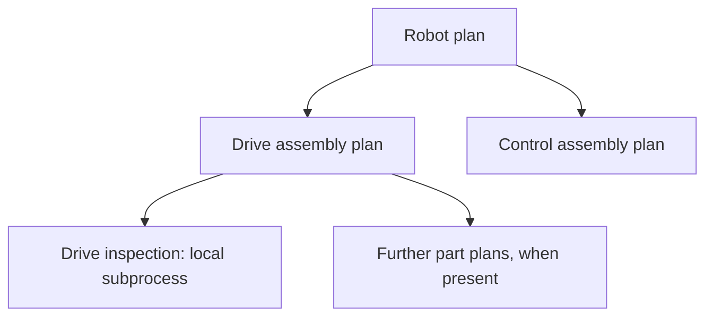

# Shared assembly plans

The selected product is the root of the current **view**, not the owner of every definition in that
view. Every independently addressable product or assembly owns its own ProcessSequencePlan. Parent
plans reference child plans by the child's AAS identifier. Opening the child directly loads the same
definition and its descendants; there is no dependency on opening its parent first.

## Ownership and data

For a product/assembly that should be selectable and independently planned:

- **Hierarchical Structures** supplies material occurrences and links to child assets.
- **Process Parameters Type** supplies process inputs and eligibility for the product selector.
- **ProcessSequencePlan** supplies the assembly's sequence, local subprocesses and child-plan links.
- **Capability Description** additionally supplies required/offered capability descriptions for matching.

A leaf may have an empty material hierarchy. Capability Description is an additional submodel, not a
replacement for any of the three structural/planning submodels. Materials without a resolvable child
AAS remain local occurrences in the owning plan. Local process-only subprocesses also stay with that
owner. A shared child root is represented in its parent's stored definition by a scope containing
`planAasId`, the parent material reference, and an empty `nodes` array. The child's internal scopes and
steps are stored only in the child's plan. Calls in the parent target that occurrence scope.

Definitions now use `process-sequence-plan/3.0`; the reader also accepts legacy 2.0 definitions. The
Submodel container and deterministic per-AAS identifiers remain unchanged. The new document version
prevents older 2.0-only editors from silently discarding shared-plan links. Composed browser drafts
contain `linkedRevisions`, a revision vector for every loaded definition. Stored owner definitions do
not contain that vector.

## Editing and persistence

The editor composes the reachable definitions into one tree with occurrence-specific scope IDs.
Selecting a shared assembly identifies the actual owner in the caption above the editor. Its steps
and local subprocesses can be edited there or through the standalone product selector. Repeated
occurrences of the same assembly definition synchronize within the open tree. Execution expansion
still distinguishes separate calls and preserves parallel prerequisites.

**Save draft** writes changed definitions back to their respective owners. An unchanged parent does
not need a new revision when only its child changes. A parent reopened later loads the latest saved
child definitions. **Reload plans** refreshes a clean open workspace. Unsaved browser drafts remain
local to their selected-root workspace; save before switching viewpoints to publish changes to the
other views. When a root or child revision changes, a stale browser draft is archived for download
instead of being restored over newer shared data.

All changed owners are checked for stale revisions before writes start; each repository save checks
again. Writes run from descendants toward parents. The repository has no cross-submodel transaction
or atomic compare-and-swap, so failures can leave a partial save. The UI reports the number saved and
retains remaining edits for retry. Successfully written owners are not rewritten on retry. Editing
the tree is disabled while a save is running.

Assembly-reference cycles and missing explicit child plans stop loading with an error. They never
become apparently valid empty replacements. Calls authored inside a shared assembly must stay within
its own subtree, so the standalone view remains meaningful. The implementation recursively loads the
reachable tree and caches each owner within that load. It is intended for finite hierarchies; large
trees still incur loading/rendering costs and do not imply infinite scale.

## Existing plans and the demo

Legacy inline assembly subtrees can be separated when their material assets resolve to an AAS.
Existing nonempty shared and inline definitions that disagree are reported rather than silently
combined. The demo seeder performs an explicit migration:

1. Preserve the robot's original attachment in `BeforeSharedAssemblies`.
2. Extract drive/control subtrees, retaining edited steps, parameters, bindings and nested subprocesses.
3. Add independent plan containers and material-hierarchy submodels to both assembly AASs.
4. Write the child definitions, then replace their inline copies in the robot with references.

Existing nonempty child plans remain authoritative. An existing empty child plan can be populated
from the inline subtree after preserving its own backup. Repeating the seed leaves saved definitions
unchanged and restores missing example definitions. The robot still expands to seven example steps;
opening Drive shows its preparation, installation and inspection, while Control shows its two steps.

## Verification

Unit coverage includes standalone and parent edits, newly created nested subprocesses, repeated
assembly occurrences, revision conflicts, partial-save retries, cycles, missing linked definitions,
and migration preserving the expanded process. Browser integration covers saving from both viewpoints,
creating a nested subprocess through the parent, and reopening it standalone from server storage.
